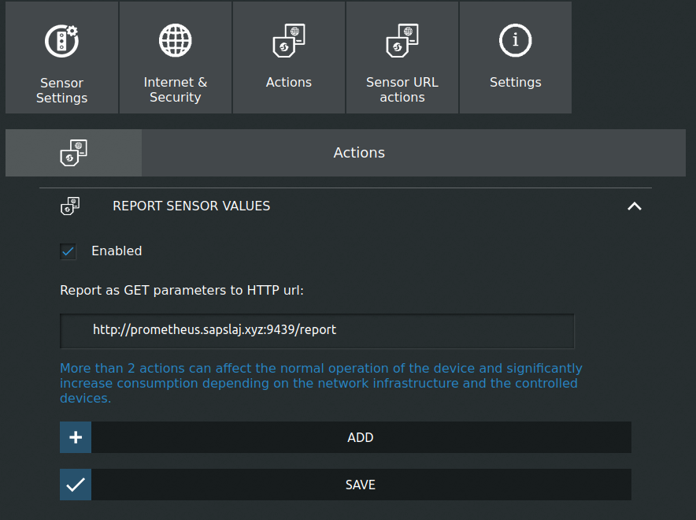

# shelly_ht_exporter

An excurciatingly shitty Prometheus exporter for [Shelly H&T sensors](https://shelly.cloud/products/shelly-humidity-temperature-smart-home-automation-sensor/).

## Setup

1. Run Exporter

via container:

```
docker run -p 9439:9439 ghcr.io/sapslaj/shelly_ht_exporter:latest
```

not via container:

```
go mod download
go build
./shelly_ht_exporter
```

2. Configure Sensor

Configure the sensor to report sensor values to the `/report` endpoint on the exporter.



3. Configure Prometheus

do the normal thing to get promtheus to scrape it
